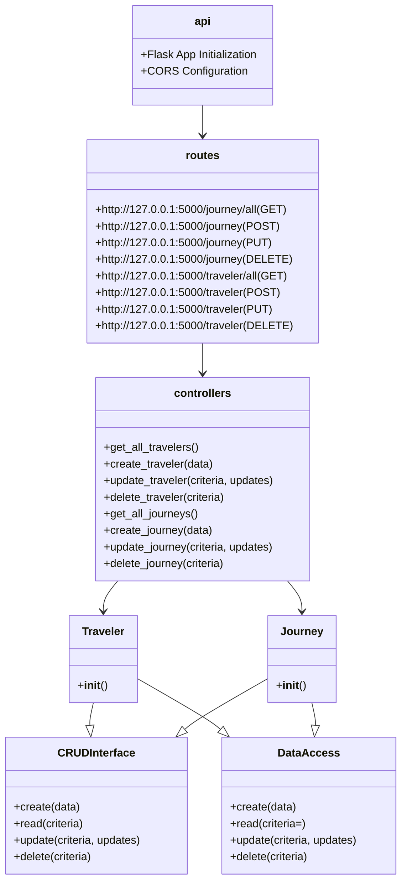

# Back-end
### Flask
Why whe chose Flask:
- [Flask](https://flask.palletsprojects.com/en/2.0.x/) is a lightweight WSGI web application framework. It is designed to make getting started quick and easy, with the ability to scale up to complex applications.

- We might want to integrate AI what is easier with Flask because it runs on Python.

## Security 

We made a config.py file that has the connection string to the database. This file is in the .gitignore so it is not visible on GitHub.
We added sonar cloud to the project to check for vulnerabilities and bad code.  
# Tests
We started making [[PRO Unit Test|Unit Tests ]]  they can be found here : [[TravelXPToday Back-end Testing]].

---
# File Structure:

This is a Diagram of our application it is prone to change in the future.

## api.py

```python

from flask import Flask, jsonify
from flask_cors import CORS
from routes import bp as routes_bp
import Utils.config as config
from flask import Flask, render_template
# Initialize Flask app
server = Flask(__name__)
CORS(server)
server.register_blueprint(routes_bp)

if __name__ == "__main__":
    server.run(host=config.HOST, port=config.PORT, debug=True)


```
Here we set up the server and register the routes. 
## controller.py

```python

from traveler import Traveler
from journey import Journey

def get_all_travelers():
    traveler = Traveler()
    return traveler.read()

def create_traveler(data):
    traveler = Traveler()
    return traveler.create(data)

def update_traveler(criteria, updates):
    traveler = Traveler()
    return traveler.update(criteria, updates)

def delete_traveler(criteria):
    traveler = Traveler()
    return traveler.delete(criteria)

def get_all_journeys():
    journey = Journey()
    return journey.read()

def create_journey(data):
    journey = Journey()
    return journey.create(data)

def update_journey(criteria, updates):
    journey = Journey()
    return journey.update(criteria, updates)

def delete_journey(criteria):
    journey = Journey()
    return journey.delete(criteria)


```

Here we will implement the logic needed for the application and will set the criteria for the database. We also define the functions to get all the data from the database.
## routes.py

```python

from flask import Blueprint, jsonify, request
from flask import Flask, render_template
from controllers import (
    get_all_journeys, get_all_travelers,
    create_journey, create_traveler,
    update_journey, update_traveler,
    delete_journey, delete_traveler
)

bp = Blueprint('routes', __name__)

@bp.route('/')
def mermaid_diagram():
    return render_template('index.html')

@bp.route('/journey/all', methods=['GET'])
def journey():
    return jsonify(get_all_journeys())

@bp.route('/journey', methods=['POST'])
def add_journey():
    data = request.json
    create_journey(data)
    return jsonify({"message": "Journey added successfully!"})

@bp.route('/journey', methods=['PUT'])
def modify_journey():
    criteria = request.args.to_dict() 
    updates = request.json
    update_journey(criteria, updates)
    return jsonify({"message": "Journey updated successfully!"})

@bp.route('/journey', methods=['DELETE'])
def remove_journey():
    criteria = request.args.to_dict()  
    delete_journey(criteria)
    return jsonify({"message": "Journey deleted successfully!"})

@bp.route('/traveler/all', methods=['GET'])
def travelers():
    return jsonify(get_all_travelers())

@bp.route('/traveler', methods=['POST'])
def add_traveler():
    data = request.json
    create_traveler(data)
    return jsonify({"message": "Traveler added successfully!"})

@bp.route('/traveler', methods=['PUT'])
def modify_traveler():
    criteria = request.args.to_dict() 
    updates = request.json
    update_traveler(criteria, updates)
    return jsonify({"message": "Traveler updated successfully!"})

@bp.route('/traveler', methods=['DELETE'])
def remove_traveler():
    criteria = request.args.to_dict()  
    delete_traveler(criteria)
    return jsonify({"message": "Traveler deleted successfully!"})

```
Here we define the routes for the API. We use the functions from the controller to get the data from the database and return it as JSON.
 
## DataAccess.py

```python
from pymongo import MongoClient
import Utils.config as config

class DataAccess:
    def __init__(self, collection_name):
        client = MongoClient(config.CONN, tlsAllowInvalidCertificates=True)
        db = client['Travelers']
        self.collection = db[collection_name]

    def create(self, data):
        return self.collection.insert_one(data)

    def read(self, criteria={}):
        return list(self.collection.find(criteria, {'_id': 0}))

    def update(self, criteria, updates):
        return self.collection.update_many(criteria, {'$set': updates})

    def delete(self, criteria):
        return self.collection.delete_many(criteria)

```
Here we access the database.
## Object classes journey.py and traveler.py

```python
from data_access import DataAccess
from crud_interface import CRUDInterface

class Traveler(DataAccess, CRUDInterface):
    def __init__(self):
        super().__init__('traveler')

# journey.py
from data_access import DataAccess
from crud_interface import CRUDInterface

class Journey(DataAccess, CRUDInterface):
    def __init__(self):
        super().__init__('Journeys')
```
## crud_interface.py

```python
from abc import ABC, abstractmethod

class CRUDInterface(ABC):
    @abstractmethod
    def create(self, data):
        pass

    @abstractmethod
    def read(self, criteria):
        pass

    @abstractmethod
    def update(self, criteria, updates):
        pass

    @abstractmethod
    def delete(self, criteria):
        pass
```
Interface to make sure the correct elements are there for the project to work.


